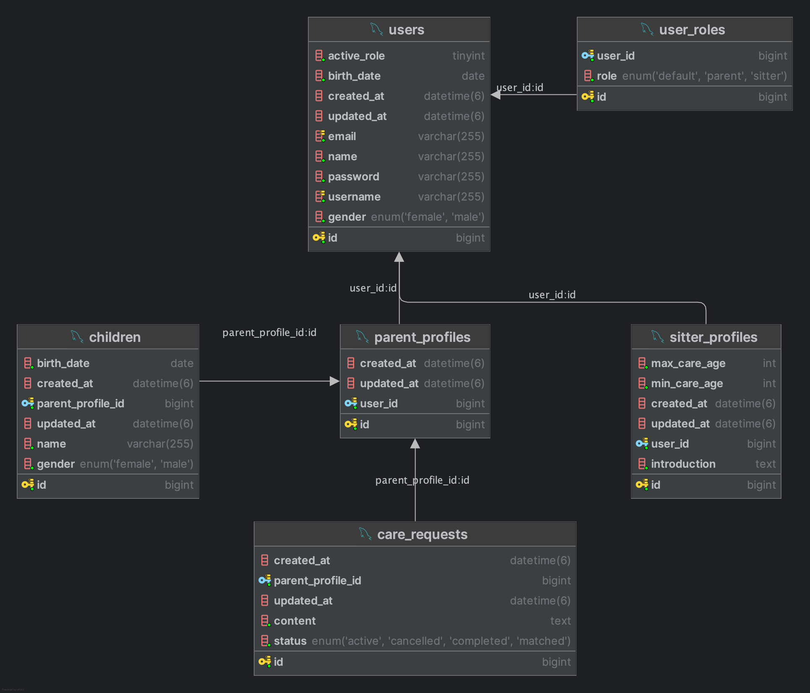

## 설계 의도 및 구조
### ERD


### 유저 역할 구조

- 모든 유저는 **기본적으로 공통 필드를 가진 `User` 엔티티**로 저장됩니다.
- 유저는 복수의 역할을 가질 수 있으며, 현재 활성 역할(`active_role`)을 지정해 API 호출 흐름에 반영합니다.
- 역할은 `user_roles` 테이블로 별도 분리하여 **시터/부모 외에도 향후 다른 역할(예: 관리자, 중재자 등)**이 생기더라도 쉽게 확장할 수 있도록 설계했습니다.

```
User (1) — (N) UserRole
```

---

### 부모 도메인 구조

- 부모 역할은 **프로필 + 자녀 정보 + 돌봄 요청**이라는 세 가지 하위 정보를 관리해야 합니다.
- 하나의 부모는 여러 명의 자녀를 가질 수 있으며, 자녀에 상관없이 돌봄 요청은 별도로 관리됩니다.
- 따라서 아래와 같은 연관관계를 기반으로 설계하였습니다.

```
ParentProfile (1) — (N) Children
ParentProfile (1) — (N) CareRequests
```

> 자녀(Child)와 돌봄 요청(CareRequest)은 하나의 기능 묶음으로 취급되는 도메인입니다.
>

---

### 시터 도메인 구조

- 시터는 본인의 **케어 가능한 연령대**와 **자기소개**를 `SitterProfile` 엔티티에 저장합니다.
- 시터 역할이 추가될 때 자동으로 생성되며, 이후 수정 가능합니다.

---

### 인증 및 보안

- JWT 기반 인증 구조 (`Authorization: Bearer <token>`)
- 비밀번호는 `BCrypt`로 해싱 처리
- `GET /users/me` API에서 비밀번호는 제외

---

## 기술 스택

| 계층 | 기술 |
| --- | --- |
| 언어 | Kotlin 1.9.25 |
| 빌드 | Gradle (Kotlin DSL) |
| 프레임워크 | Spring Boot 3.5.3 |
| 데이터베이스 | MySQL 8.0.42 |
| API 문서화 | SwaggerHub(OpenAPI 3.0) + springdoc-openapi |
| 인증 | JWT (io.jsonwebtoken:jjwt) |
| 테스트 | JUnit5 + MockMvc + Testcontainers |

---

## 주요 API 소개

서비스 요구사항을 기반으로 사용자, 시터, 부모, 인증, 돌봄 요청 기능을 다음과 같은 REST API로 분리하였습니다. 

전체 API 명세는 SwaggerHub를 통해 확인하실 수 있습니다.
- API 문서 바로가기 [momsitter-api](https://app.swaggerhub.com/apis-docs/JUNYOUNGJEON/momsitter-test/1.0.0#/User)
 - 요청/응답 DTO, 필드 설명, 예시, 상태코드까지 모두 포함됨.

### 사용자(User) 관련 API

| Method | Endpoint | 설명 |
| --- | --- | --- |
| `POST` | `/api/v1/users` | 회원가입 |
| `PATCH` | `/api/v1/users/me/info` | 기본정보 수정 |
| `PATCH` | `/api/v1/users/me/password` | 비밀번호 변경 |
| `PATCH` | `/api/v1/users/me/role` | 현재 활동 역할 변경 |
| `GET` | `/api/v1/users/me` | 내 정보 조회 |

### 역할 확장(Role Extension)

| Method | Endpoint | 설명 |
| --- | --- | --- |
| `POST` | `/api/v1/users/extend-role/sitter` | 부모 → 시터 역할 확장 |
| `POST` | `/api/v1/users/extend-role/parent` | 시터 → 부모 역할 확장 |

### 시터 프로필 API

| Method | Endpoint | 설명 |
| --- | --- | --- |
| `PATCH` | `/api/v1/sitter/profile` | 시터 프로필 정보 수정 |

### 자녀(Child) API

| Method | Endpoint | 설명 |
| --- | --- | --- |
| `POST` | `/api/v1/child` | 자녀 정보 등록 |
| `PATCH` | `/api/v1/child/{childId}/profile` | 자녀 정보 수정 |

### 돌봄요청(CareRequest) API

| Method | Endpoint | 설명 |
| --- | --- | --- |
| `POST` | `/api/v1/care-requests` | 돌봄 요청 생성 |
| `PUT` | `/api/v1/care-requests/{id}` | 돌봄 요청 수정 |

### 인증(Auth) API

| Method | Endpoint | 설명 |
| --- | --- | --- |
| `POST` | `/api/v1/auth/login` | 로그인 및 JWT 토큰 발급 |

---

## 테스트 전략

| 계층 | 테스트 종류 | 설명 |
| --- | --- | --- |
| 도메인 | 단위 테스트 | 핵심 도메인 메서드, 유효성 검증 |
| 애플리케이션 | 통합 테스트 | 서비스 단위에서 DB와 함께 흐름 검증 |
| 프레젠테이션 | E2E 테스트 | `@SpringBootTest` + `MockMvc`를 활용한 실제 API 호출 시나리오 테스트 |

---

### 테스트 커버리지

HTML 문서: [htmlReport/index.html](docs/test-report/htmlReport/index.html)

| 측정 항목 | 수치 |
| --- | --- |
| Class Coverage | 91.4% (117/128) |
| Method Coverage | 84% (288/343) |
| Branch Coverage | 66.5% (153/230) |
| Line Coverage | 86.9% (938/1080) |

테스트를 통해 로직 누락 및 그레이존을 줄이고, 사소한 변경에도 API 이상 여부를 즉시 감지할 수 있도록 구성했습니다.

---

## 외부 의존성
- `jackson-module-kotlin`: Kotlin의 non-null, data class 구조를 JSON 직렬화/역직렬화에 자연스럽게 매핑하기 위해 사용
- `org.mindrot:jbcrypt`: 사용자 비밀번호를 안전하게 해싱하기 위한 목적으로 `BCrypt` 알고리즘 사용
- `springdoc-openapi-starter-webmvc-ui`: Swagger UI 기반 API 명세 자동 문서화
- `io.jsonwebtoken:jjwt-*`: JWT 기반 인증 구현을 위한 경량 라이브러리로, 토큰 생성/검증/파싱 기능 제공
- `mockk`: Kotlin에 특화된 Mocking 프레임워크로, 직관적이고 간결한 테스트 코드 작성을 위함
- `testcontainers:mysql`: 실제 MySQL 환경과 유사한 조건에서의 통합 테스트 수행을 위해 사용
- `spring-boot-testcontainers`: Testcontainers를 Spring 환경과 자동 연동하여, 더 간편하게 테스트 컨테이너를 관리하기 위해 사용

## 실행 방법

### 1. 프로젝트 클론

```bash
git clone https://github.com/thedev-junyoung/momsitter-test.git
cd momsitter-test
```

---

### 2. 실행 전 준비사항

- 기술스택 참고
- `application.yml` 등 추가 설정 파일은 필요하지 않음

---

### 3. DB (MySQL) 실행

> Testcontainers를 사용하므로 docker compose로 MySQL을 띄우지 않아도 테스트는 가능합니다.
>
>
> 하지만 **로컬 실행(Spring Boot 실행)** 을 위해선 다음 명령으로 MySQL 컨테이너를 실행해야 합니다:
>

```bash
docker compose up -d
```

---

### 4. 테스트 실행

> 테스트는 내부적으로 Testcontainers를 활용하여 MySQL 컨테이너를 자동으로 띄워 수행됩니다.
>

```bash
./gradlew test
```

---

### 5. 서버 실행

> 로컬에서 Spring Boot 앱을 실행하려면 다음 명령어를 입력하세요:
>

```bash
./gradlew bootRun
```

---

### 6. API 문서 (Swagger)

- 브라우저에서 다음 URL로 접속하여 API 명세 확인 가능:

```
<http://localhost:8080/swagger-ui/index.html>
```

또는

- SwaggerHub 공개 문서: [momsitter-api](https://app.swaggerhub.com/apis-docs/JUNYOUNGJEON/momsitter-test/1.0.0)

---

